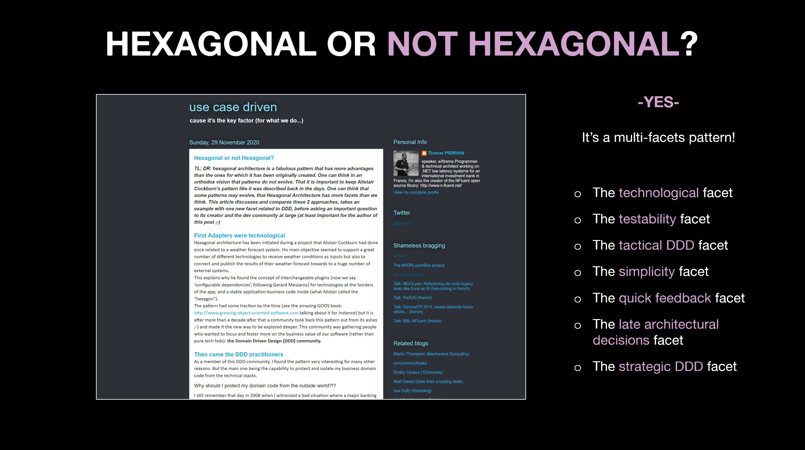
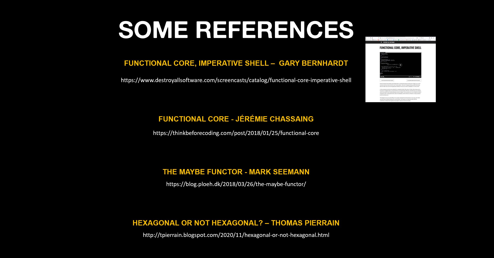

# BEYOND HEXAGONAL ARCHITECTURE
The support of our live coding session (made at __[Virtual DDD](https://twitter.com/virtualDDD)__, February 2nd, 2021)

Thanks to __[Kenny](https://twitter.com/kenny_baas/)__ & __[Krisztina](https://twitter.com/YellowBrickC/)__ for their warm welcome!

If you have questions or ideas to share, you can reach us on twitter (__[Thomas (aka. use case driven)](https://twitter.com/tpierrain)__ and __[Bruno](https://twitter.com/brunoboucard)__).

## All slides are available here:
https://fr.slideshare.net/ThomasPierrain/beyond-hexagonal-architecture

## Video of the talk

__>>>__ https://www.youtube.com/watch?v=SAjsP2igBNk&feature=youtu.be  __<<<__

--- 

## HEXAGONAL ARCHITECTURE VERSION

### Acceptance tests (Outside-in diamond style)
https://github.com/42skillz/livecoding-beyond-hexagonal-architecture/blob/hexagonal/SeatsSuggestions/TheaterSuggestions.Tests/AcceptanceTests/SeatsSuggestionsControllerShould.cs

### The Hexagon (SeatAllocator)
https://github.com/42skillz/livecoding-beyond-hexagonal-architecture/blob/hexagonal/SeatsSuggestions/SeatsSuggestions.Domain/SeatAllocator.cs

### The left-side port (WebController)
https://github.com/42skillz/livecoding-beyond-hexagonal-architecture/blob/hexagonal/SeatsSuggestions/SeatsSuggestions.Api/Controllers/SeatsSuggestionsController.cs

### We have a question for you

(The answer of the audience was YES (91%))

### Thomas says

#### Detailled version
___http://tpierrain.blogspot.com/2020/11/hexagonal-or-not-hexagonal.html___

---

## FUNCTIONAL CORE VERSION

### The Functional core (SeatAllocator)
https://github.com/42skillz/livecoding-beyond-hexagonal-architecture/blob/functional-core/SeatsSuggestions/SeatsSuggestions.Domain/SeatAllocator.cs

### The Imperative Shell (WebController)
https://github.com/42skillz/livecoding-beyond-hexagonal-architecture/blob/functional-core/SeatsSuggestions/SeatsSuggestions.Api/Controllers/SeatsSuggestionsController.cs

---

## REFERENCES

- __[Functional Core, Imperative Shell –  Gary Bernhardt](https://www.destroyallsoftware.com/screencasts/catalog/functional-core-imperative-shell)__

- __[Functional Core - Jérémie Chassaing](https://thinkbeforecoding.com/post/2018/01/25/functional-core)__

- __[The Maybe functor - Mark Seemann](https://blog.ploeh.dk/2018/03/26/the-maybe-functor/)__

- __[Hexagonal or not hexagonal? – Thomas Pierrain](http://tpierrain.blogspot.com/2020/11/hexagonal-or-not-hexagonal.html
)__

